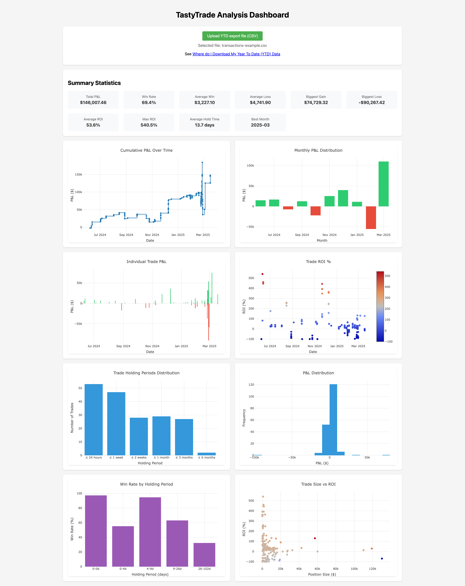

# TastyTrade Analytics Dashboard

Track and analyze your trading performance with this simple dashboard. Simply upload your TastyTrade YTD CSV file to see your trading stats, P&L charts, and performance metrics. And worry not about privacy - all data is process locally in your browser.

## 💖 Support the Project
If you find this tool helpful, consider supporting its development:

 

Your support helps maintain and improve this free, open-source tool!

## 🔒 Privacy

All data processing occurs entirely in your browser. No data is uploaded to any external servers:
- CSV files are processed locally using PapaParse
- Visualizations are rendered client-side using Plotly.js
- No tracking or analytics are implemented

## 📊 Features

- Cumulative P&L tracking over time
- Monthly P&L distribution analysis
- Individual trade performance metrics
- ROI analysis and visualization
- Trade holding period analysis
- Win rate statistics by holding period
- Position size vs. ROI correlation
- Comprehensive summary statistics

## 🚀 Usage

1. Export your YTD transaction data following the official guide:
   [Where do I Download My Year To Date (YTD) Data](https://support.tastytrade.com/support/s/solutions/articles/43000536959)

2. Visit [https://wozniakpawel.github.io/tastytrade-dashboard/](https://wozniakpawel.github.io/tastytrade-dashboard/)

3. Click "Upload YTD export file" and select your exported CSV file

## 💻 Technical Details

Built with:
- Plotly.js for interactive data visualization
- PapaParse for CSV parsing
- Lodash for data manipulation
- Pure JavaScript for data processing
- Responsive CSS Grid layout

## 🤝 Contributing

Contributions are welcome! Feel free to open issues or submit pull requests.

## 📄 License

MIT License (see LICENSE file for details)
